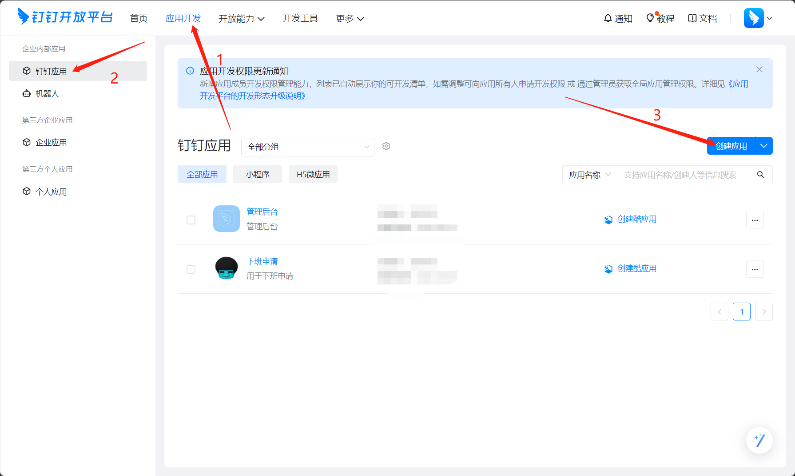
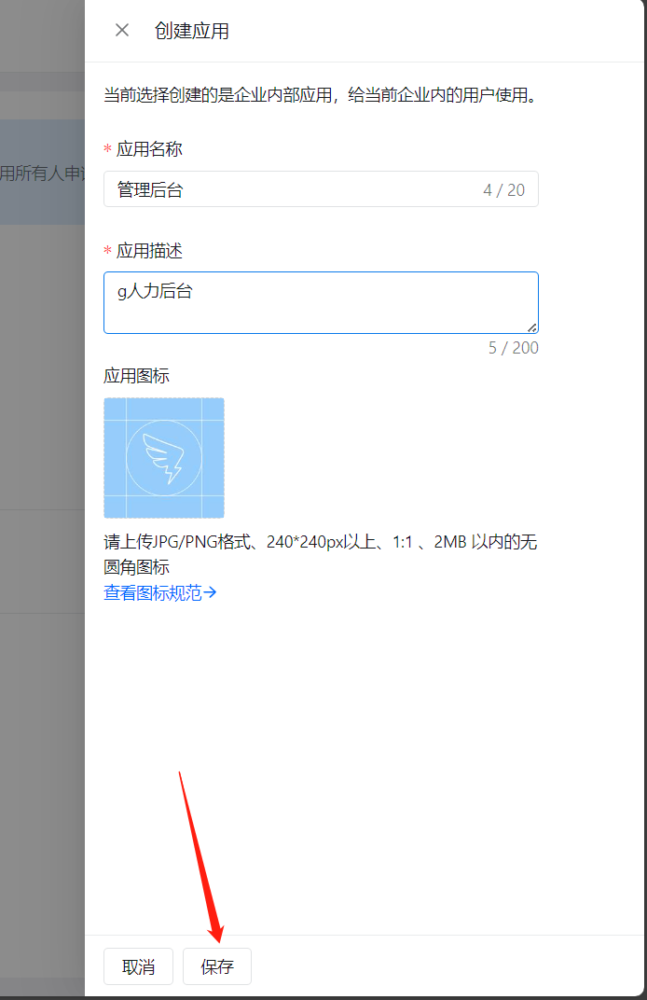
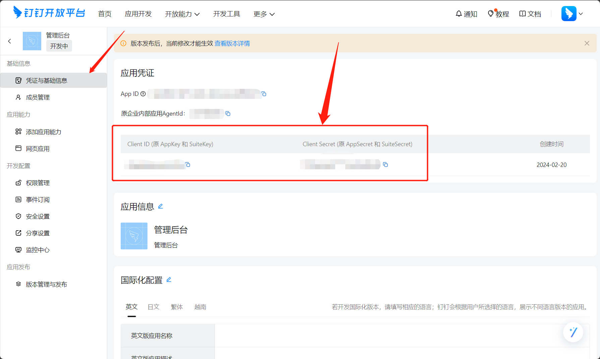
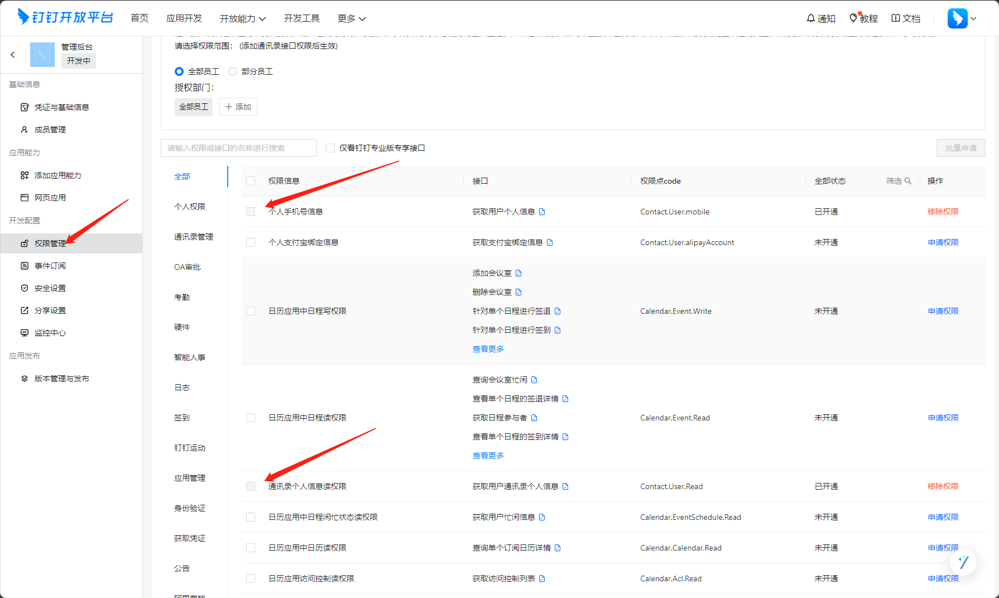
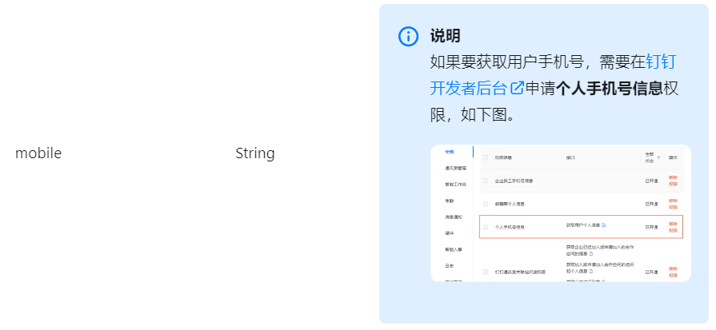
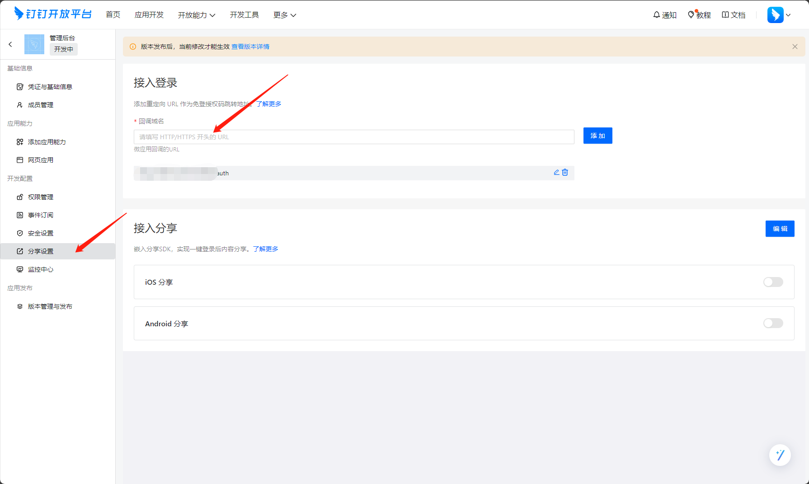
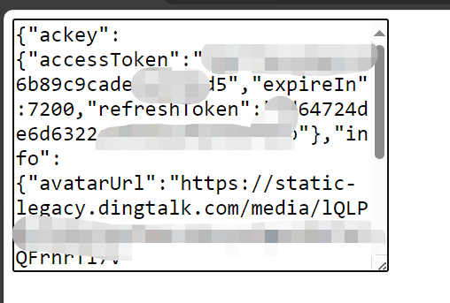

# 钉钉扫码登录demo
> 基于Nodejs

## 安装依赖
```shell
pnpm install
```
## 运行
```shell
pnpm start
# 访问 http://localhost:3000
```

## 参考资料

 - [实现登录第三方网站](https://open.dingtalk.com/document/isvapp/tutorial-enabling-login-to-third-party-websites)
 - [获取用户token api文档](https://open.dingtalk.com/document/orgapp/obtain-user-token#)


## 1. 查看文档
> [实现登录第三方网站](https://open.dingtalk.com/document/isvapp/tutorial-enabling-login-to-third-party-websites)

官方文档中开放平台截图和真实环境不一致，所以记录下

## 2. 创建应用
> [钉钉开放平台](https://open.dingtalk.com/)

1.登录后, 选择顶部导航栏`应用开发`, 再选择侧边栏`钉钉应用`, 点击右侧`创建应用`


2.输入信息后点击保存


3.进入应用, 点击侧边栏`凭证与基础信息`, 先记录`client_id`和`client_secret`, 这个前后端都需要用到


4.点击`权限管理`, 选中`个人手机号信息`和`通讯录个人信息读权限`, 方便登录后获取登录人的信息(仅demo演示)
> [权限文档](https://open.dingtalk.com/document/isvapp/dingtalk-retrieve-user-information)



开通`通讯录个人信息读权限`需要`个人手机号信息`的辅助


5.点击`分享设置`, 接入登录的回调域名后面配置成后端接口地址


## 3. 后端开发
### 1) 安装依赖
```bash
pnpm init
pnpm add @alicloud/dingtalk @alicloud/openapi-client @alicloud/tea-util
```

**注意:** 使用SDK开发时, 可以进入到node_modules中查看sdk源码, 了解代码结构, 方便引入代码和调用方法, 感觉挺乱的

### 2) 获取用户授权方法
```js
const config = new $OpenApi.Config({ })
config.protocol = 'https'
config.regionId = 'central'
const client = new oauth2_1_0.default(config)
const getUserTokenRequest = new oauth2_1_0.GetUserTokenRequest({
  clientId: CLIENTID,
  clientSecret: CLIENTSECRET,
  code: req.query.authCode,
  refreshToken: '',
  grantType: 'authorization_code',
})
```

### 3) 根据授权的token查询用户信息
```js
async function getUserInfo (accessToken) {
  const config = new $OpenApi.Config({ })
  config.protocol = 'https'
  config.regionId = 'central'
  const client = new contact_1_0.default(config)
  const getUserHeader = new contact_1_0.GetUserHeaders()
  getUserHeader.xAcsDingtalkAccessToken = accessToken
  const infoRes = await client.getUserWithOptions('me', getUserHeader, new $Util.RuntimeOptions())
  return infoRes
}
```

### 4) 完整代码
```js
import express from 'express'
import { contact_1_0, oauth2_1_0 } from '@alicloud/dingtalk'
import * as $OpenApi from '@alicloud/openapi-client'
import * as $Util from '@alicloud/tea-util'

const CLIENTID = '' // 应用 client_id
const CLIENTSECRET = '' // 应用 client_secret

const app = express()
app.use(express.static('public'))

/**
 * 获取用户授权
 */
app.get('/auth', async (req, res) => {
  const config = new $OpenApi.Config({ })
  config.protocol = 'https'
  config.regionId = 'central'
  const client = new oauth2_1_0.default(config)
  const getUserTokenRequest = new oauth2_1_0.GetUserTokenRequest({
    clientId: CLIENTID,
    clientSecret: CLIENTSECRET,
    code: req.query.authCode,
    refreshToken: '',
    grantType: 'authorization_code',
  })
  try {
    const result = await client.getUserToken(getUserTokenRequest)
    const info = await getUserInfo(result.body.accessToken)
    res.json({
      data: {
        ackey: result.body,
        info: info.body
      }
    })
  } catch (err) {
    console.log(err)
  }
})

app.listen(3000, () => {
  console.log(`Example app listening on port 3000`)
})

/**
 * 获取用户信息
 * @param {string} accessToken
 * @returns 用户信息返回体
 */
async function getUserInfo (accessToken) {
  const config = new $OpenApi.Config({ })
  config.protocol = 'https'
  config.regionId = 'central'
  const client = new contact_1_0.default(config)
  const getUserHeader = new contact_1_0.GetUserHeaders()
  getUserHeader.xAcsDingtalkAccessToken = accessToken
  const infoRes = await client.getUserWithOptions('me', getUserHeader, new $Util.RuntimeOptions())
  return infoRes
}


```

## 4. 前端开发
> 内嵌二维码方式登录授权

### 1) 前端页面位置

需要注意, 要把前端页面和后端服务地址配在同域名端口协议下.(嵌入二维码的页面必须和redirect_uri参数所指定的页面“同源”，否则扫码后会没有反应，“同源”指：协议相同、二级或三级域名相同、端口号相同等。)

由于是demo, 所以直接用express提供静态服务(`app.use(express.static('public'))`), 把index.html放在public目录, 来进行前端访问, 也可以使用nginx

### 2) 引入钉钉登录的包
```html
<script src="https://g.alicdn.com/dingding/h5-dingtalk-login/0.21.0/ddlogin.js"></script>
```

### 3) 编写逻辑
需要创建一个div, 用于钉钉在其中创建二维码, 二维码是存在于`iframe`中的

`redirect_uri`需要跟开放平台配置的回调地址一样

```html
<!DOCTYPE html>
<html lang="en">
  <head>
    <meta charset="UTF-8" />
    <meta name="viewport" content="width=device-width, initial-scale=1.0" />
    <title>Document</title>
  </head>
  <body>
    <div id="self_defined_element"></div>
    <textarea id="js-info" cols="30" rows="10"></textarea>
    <script src="https://g.alicdn.com/dingding/h5-dingtalk-login/0.21.0/ddlogin.js"></script>
    <script>
      // STEP3：在需要的时候，调用 window.DTFrameLogin 方法构造登录二维码，并处理登录成功或失败的回调。
      window.DTFrameLogin(
        {
          id: 'self_defined_element',
          width: 300,
          height: 300,
        },
        {
          redirect_uri: encodeURIComponent(''), // 应用配的登录回调地址
          client_id: '', // 应用的client_id
          scope: 'openid',
          response_type: 'code',
          prompt: 'consent',
        },
        async (loginResult) => {
          document.getElementById('self_defined_element').style.display = 'none'
          const { redirectUrl } = loginResult
          // 请求后端接口, 获取用户信息
          const res = await fetch(redirectUrl).then(res => res.json())
          document.getElementById('js-info').value = JSON.stringify(res.data)
        },
        (errorMsg) => {
          alert(`Login Error: ${errorMsg}`);
        }
      );
    </script>
  </body>
</html>
```

## 5. 结果
由于使用内嵌二维码登录授权的方式, 所以用户跳转需要自己触发


